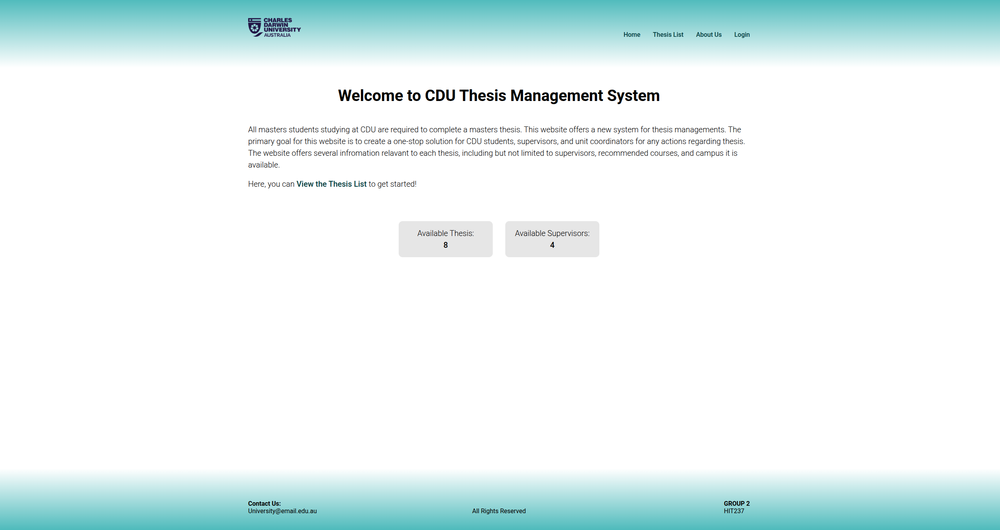
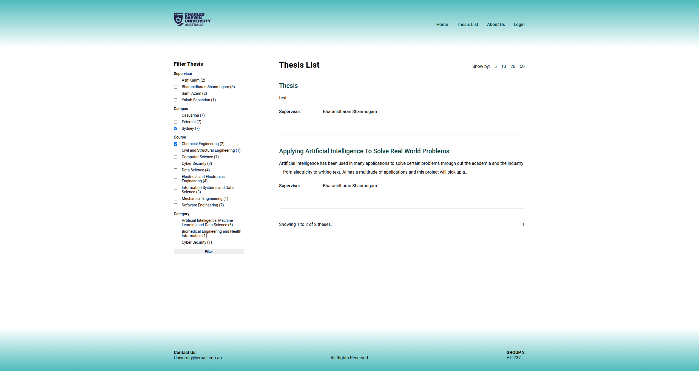
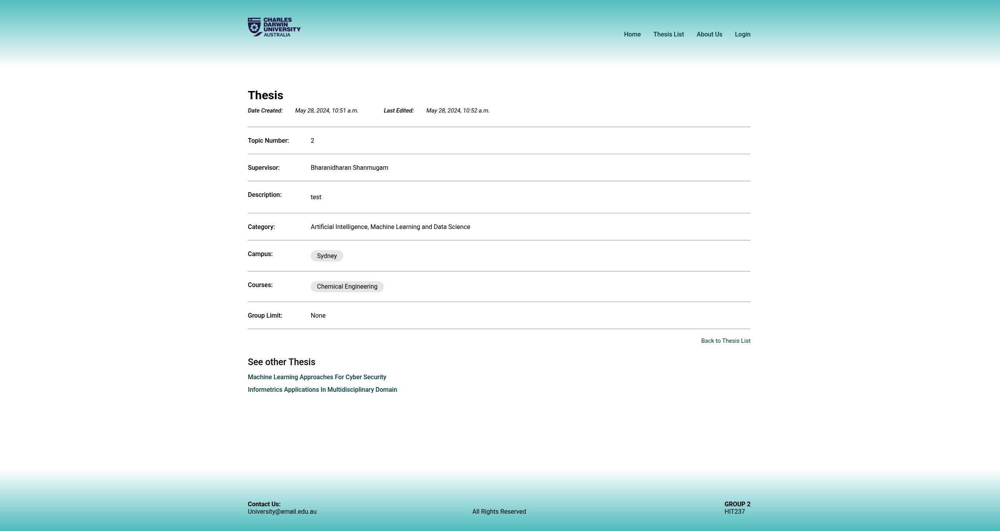
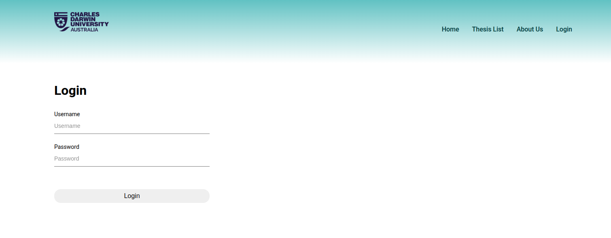
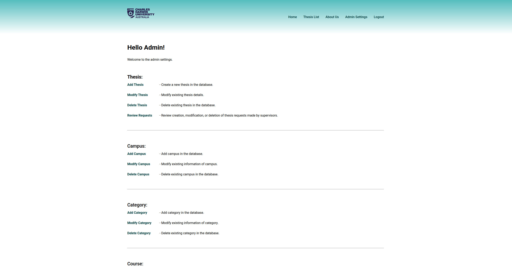
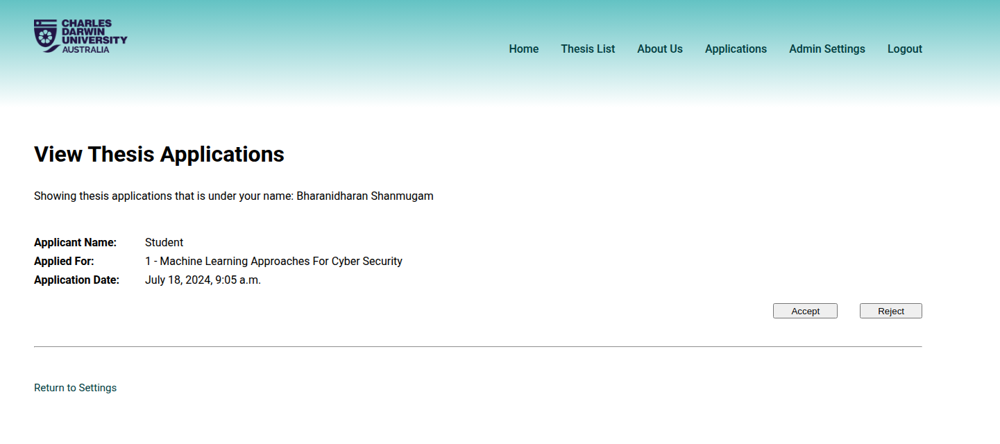

# Thesys

This is a school project. It provides a seamless thesis management system for
CDU students, supervisors, and unit coordinators. The group used a combination
of HTML and CSS for the frontend of the website, and Python's **Django** to
handle the backend.

## Screenshots

 
 
 
 
 
 
 
